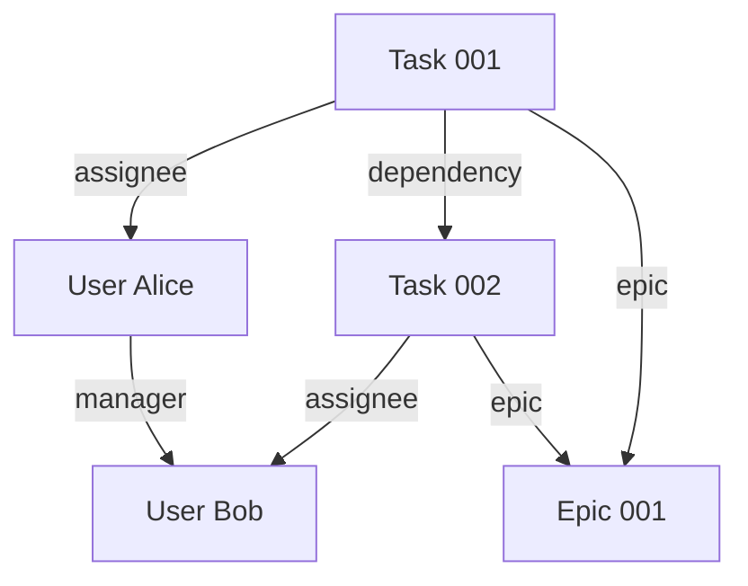

# TypeForge

A lightweight REST API for creating custom objects and link between them.

## Overview

TypeForge allows you to define custom types, like User, Note or Task, create
assosiated objects and connect objects in meeningfull way.



See [API example](doc/api-example-1.md)

**Key Features:**

- `/types` endpoint for type management
- `/objects/<type_id>` endpoint for object management
- mandatory properties (`title`, `icon`, `status`) + unlimited custom properties for all types.
- detailed errors (e.g., invalid schemas, missing types, database failures).
- unit tests: `pytest`, `WebTest`, and `pytest-mock`
- data storage: SQLite
- web: `bottle.py`

**Endpoints Overview:**

- **Types**:
  - `POST /types`: Create a new type with a JSON schema.
  - `GET /types`: List all types.
  - `GET /types/<type_id>`: Retrieve a specific type.
  - `DELETE /types/<type_id>`: Delete a type and its table.
- **Objects**:
  - `POST /objects/<type_id>`: Create an object for a type.
  - `GET /objects/<type_id>`: List objects for a type.
  - `GET /objects/<type_id>/<object_id>`: Retrieve a specific object.
  - `DELETE /objects/<type_id>/<object_id>`: Delete an object.

## Installation

1. Clone the repository:
   ```bash
   git clone https://github.com/yourusername/typeforge.git
   cd typeforge
   ```
2. Create and activate a virtual environment:
   ```bash
   uv venv .venv
   source .venv/bin/activate # On Windows: .venv\Scripts\activate
   ```
3. Install dependencies:
   ```bash
   uv pip install -r requirements.txt
   uv pip install -r requirements-test.txt
   ```

## Usage

Run the API server:

```bash
python type_app.py
```

The server runs on `http://localhost:8080` by default.

See [API example](doc/api-example-1.md)

## Testing

Run all tests with coverage:

```bash
pytest --dist=no -x --cov=type_app --cov-report=html
```

## License

MIT License. See [LICENSE](LICENSE) for details.
